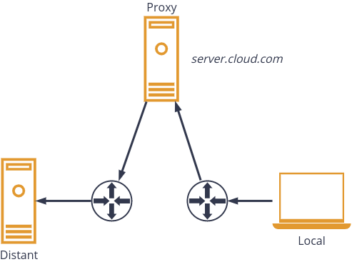

In this post we explain a way to connect to a remote machine behind a NAT with a reverse ssh tunnel. Here we use a third
party server as we assume that both local and distant machines are not publicly available (neither public IP nor port forwarding).




Because of NAT, we must first set-up a tunnel between the distant server and the proxy.
The proxy is running a ssh server listening on port `22000` (we can connect to it with username `user` and a secret password):

```bash
sshd -D -p 22000 -o "AllowTcpForwarding=all"
```

The distant machine is also running a ssh server on port `10000`.
From the distant machine, we must set up the tunnel 
```bash
ssh -NR 22100:localhost:10000 -p 22000 user@server.cloud.com
```

What does this command do? Taking it from the end, it connects to the proxy server (`-p 22000 user@server.cloud.com`). Then it tells the proxy server to bind its port `22100` to the ssh server of the distant machine.


Thus, from the proxy, you can connect (with ssh) to `localhost:22100` and you will have a remote session on the distant machine (if you have the right credentials).

Now we just have to connect our local machine to the proxy and hop to  `localhost:22100`. Below we detail a practical example.

Let us imagine that our distant machine only accepts public key authentication (user `guest` with private key stored in `~/.ssh/distant`).
We can ease the connection, with the following ssh config file (`~/.ssh/config`).

```ini
Host proxy
    User user
    Port 22000
    Hostname server.cloud.com

Host distant
    # Connect to the host 'proxy' 
    # (defined above)
    ProxyCommand ssh -W %h:%p proxy
    # Here you can imagine that you are
    # on the proxy server. The following
    # information are used to finally 
    # reach the distant machine.
    User guest
    Port 22100
    Hostname localhost
    IdentityFile ~/.ssh/distant
```

Now we just have to type
```bash
ssh distant
```

When you run this command, it uses the `ProxyCommand` to connect to the proxy. Briefly it binds a local port to the ssh proxy server. Then it uses the tunnel (`localhost:22100`)
to reach the distant machine: user `guest` with the locally stored authentication key  `~/.ssh/distant`.

In particular, this method prevents from forwarding the ssh agent to the proxy server, so it does no expose local ssh secrets on the proxy server.
Credentials are merely passed through the whole [and encrypted] tunnel (local -- distant) and cannot be highjacked.
